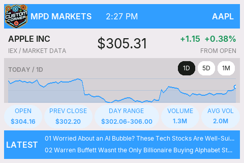

# MPD 1.0 — Multi-Purpose Display

MPD is a collection of beginner-friendly information displays from
[**The Custom Corner**](https://www.youtube.com/@TheCustomCorner101), built for
the exact **Waveshare ESP32-S3-Touch-LCD-3.5** board. Each application is a
separate Arduino sketch, so you can install only the display you want.

## Available applications

### Weather

The weather application uses [Open-Meteo](https://open-meteo.com/) and does not
require an API key. It displays:

- Current temperature and conditions
- Feels-like temperature
- Daily high and low
- Humidity, wind speed, and precipitation probability
- Last-checked time and a live clock for the configured location
- A touch-accessible QR code for The Custom Corner channel

The LCARS-inspired interface defaults to New York, NY.


Application folder:

```text
applications/weather/MPD_Weather/
```

### Stocks

The stock application uses [StockData.org](https://www.stockdata.org/) and
requires a free API token. It displays:

- Current price and the dollar/percentage change from the day's open
- Open, previous close, day's range, volume, and average volume
- Touch-selectable `1D`, `5D`, and `1M` charts
- The first two available company/market news headlines
- A live U.S. Eastern market clock
- The same channel QR modal and one-shot screenshot feature as the weather app



Application folder:

```text
applications/stocks/MPD_Stocks/
```

StockData.org currently advertises a free plan with no billing details
required. API limits and plan terms can change, so review its
[current documentation](https://www.stockdata.org/documentation) before setup.
Its own documentation states that the data is indicative and is not appropriate
for trading purposes. This project is an informational display, not financial
advice or a trading system.

## Exact supported hardware

This project currently targets:

- **Waveshare ESP32-S3-Touch-LCD-3.5**
- Waveshare SKU **30733**
- The original/non-B model — not the `3.5B`
- ESP32-S3R8 with 8 MB PSRAM and 16 MB flash
- 3.5-inch 320×480 ST7796 SPI display

[Buy the exact Waveshare ESP32-S3-Touch-LCD-3.5 board on Amazon](https://amzn.to/4fVmvU4)
*(affiliate link)*

> **Affiliate disclosure:** As an Amazon Associate I earn from qualifying
> purchases. If you purchase through this link, The Custom Corner may receive a
> commission at no additional cost to you.

The LCD reset signal is controlled through the onboard TCA9554 I/O expander.
Sketches intended for similar-looking ESP32-S3 displays will not necessarily
work on this board.

## Tested software versions

Use these versions for a reproducible setup:

| Component | Tested version |
|---|---:|
| Arduino IDE | 2.3.10 |
| `esp32` by Espressif Systems | 3.3.11 |
| GFX Library for Arduino | 1.6.7 |
| TCA9554 by Rob Tillaart | 0.1.2 |
| ArduinoJson | 7.4.3 |
| SensorLib | 0.3.1 |

Do not use the Arduino_GFX 1.5.5 copy bundled in Waveshare's original package
with ESP32 core 3.3.11. That combination fails to compile because it uses an
older `spiFrequencyToClockDiv()` API. Arduino_GFX 1.6.7 contains the required
compatibility fix.

## Install and choose an application

1. Download this repository with **Code → Download ZIP**, then extract it.
2. Choose one application folder under `applications/`.
3. Open that application's `.ino` file in Arduino IDE.
4. Install the exact library versions listed above with Library Manager.
5. Create and fill in the application's local `secrets.h` as described below.
6. Apply the recorded board settings, compile, and upload.

The weather and stock sketches are independent. You do not combine their files
in one Arduino sketch folder.

## Configure Wi-Fi and API secrets

Every application folder contains `secrets.example.h`. Copy that file in the
same folder and name the copy `secrets.h`. The real file is ignored by Git and
must never be committed.

For weather:

```cpp
#pragma once

#define WIFI_SSID "YOUR_WIFI_NAME"
#define WIFI_PASSWORD "YOUR_WIFI_PASSWORD"
```

For stocks, first [create a StockData.org account](https://www.stockdata.org/)
and copy the API token from its dashboard:

```cpp
#pragma once

#define WIFI_SSID "YOUR_WIFI_NAME"
#define WIFI_PASSWORD "YOUR_WIFI_PASSWORD"
#define STOCKDATA_API_TOKEN "YOUR_STOCKDATA_API_TOKEN"
```

Close and reopen the sketch if Arduino IDE does not immediately show the new
`secrets.h` tab.

## Change the weather location

Open
[`LocationConfig.h`](applications/weather/MPD_Weather/LocationConfig.h). It
contains the three location values that normally need to be changed:

```cpp
constexpr char WEATHER_LOCATION[] = "NEW YORK, NY";
constexpr float WEATHER_LATITUDE = 40.7128f;
constexpr float WEATHER_LONGITUDE = -74.0060f;
```

1. Find the desired city with the
   [Open-Meteo Geocoding API](https://open-meteo.com/en/docs/geocoding-api).
2. Copy its latitude and longitude into `WEATHER_LATITUDE` and
   `WEATHER_LONGITUDE`.
3. Change `WEATHER_LOCATION` to the uppercase label shown in the title bar.
4. Keep the label short enough to fit beside the title and clock.
5. Compile and upload the sketch again.

The request uses Open-Meteo's `timezone=auto` option. The returned UTC offset
sets the display clock, so there is no separate timezone setting.

## Change the stock symbol

Open [`StockConfig.h`](applications/stocks/MPD_Stocks/StockConfig.h) and change
the ticker:

```cpp
#define STOCK_SYMBOL "AAPL"
```

Use an uppercase U.S.-listed symbol supported by StockData.org, then compile and
upload the sketch again. The application requests the quote, intraday/end-of-day
history, volume statistics, and related news for that symbol.

To remain considerate of free API limits, the stock sketch caches chart data
and uses separate refresh intervals: quotes every 30 minutes, the active-day
chart every 2 hours, news every 3 hours, and end-of-day history every 12 hours.
Failed range requests are held for 5 minutes before another attempt.

## Arduino board configuration

Select **ESP32S3 Dev Module**, then use:

| Tools option | Value |
|---|---|
| USB CDC On Boot | Enabled |
| CPU Frequency | 240MHz (WiFi) |
| Core Debug Level | None |
| USB DFU On Boot | Disabled |
| Erase All Flash Before Sketch Upload | Disabled |
| Events Run On | Core 1 |
| Flash Mode | QIO 80MHz |
| Flash Size | 16MB (128Mb) |
| JTAG Adapter | Disabled |
| Arduino Runs On | Core 1 |
| USB Firmware MSC On Boot | Disabled |
| Partition Scheme | 16M Flash (3MB APP/9.9MB FATFS) |
| PSRAM | OPI PSRAM |
| Upload Mode | UART0 / Hardware CDC |
| Upload Speed | 921600 |
| USB Mode | Hardware CDC and JTAG |
| Zigbee Mode | Disabled |

Select the board's COM port even if Arduino IDE describes it as
`ESP32 Family Device, Ozobot DRVKit`. That text is a VID/PID
auto-identification quirk; the board selection must remain
**ESP32S3 Dev Module**.

## Upload

Compile the selected sketch first. After it verifies cleanly, connect the board,
select its COM port, and click **Upload**.

> [!WARNING]
> Uploading an application overwrites the Waveshare factory demonstration
> firmware.

The Serial Monitor baud rate is **115200**. On startup, each application reports
its display, touch, Wi-Fi, HTTP, JSON, and data-loading status.

Both applications deliberately keep the display SPI clock at **40 MHz** for the
stable baseline. Higher SPI speeds have not been enabled.

## Touch controls

- Tap The Custom Corner logo to open the channel QR code.
- Tap anywhere on the QR screen to dismiss it.
- In the stock application, tap `1D`, `5D`, or `1M` to change the chart.

The stock application uses enlarged invisible hit areas and FT6336 event-state
recovery so taps remain responsive after blocking redraws or network work. The
root cause, final state machine, exact hit regions, and clean-PC regression test
are documented in [`docs/touch-handling.md`](docs/touch-handling.md).

## Capture a screenshot

Both applications can send one exact 480×320 screenshot to a Windows PC over
USB serial. The firmware temporarily redraws the latest screen into PSRAM,
transfers the RGB565 pixels, frees the temporary framebuffer, and resumes normal
display operation.

Close Arduino Serial Monitor, then use the Python utility in
[`tools/screenshot-capture`](tools/screenshot-capture/README.md):

```powershell
py -m venv .venv
.\.venv\Scripts\python -m pip install -r tools\screenshot-capture\requirements.txt
.\.venv\Scripts\python tools\screenshot-capture\capture_screenshot.py `
  --port COM5 `
  --output mpd-display.png
```

Change `COM5` if the board uses another port. The tool requests one frame,
validates its CRC32 checksum, writes the PNG, and exits. The live application
screen must already be loaded before capture.

## Change the interface fonts

The checked-in `MPDAAFonts.h` files were generated from desktop fonts rather
than written by hand. The reusable converter and Windows instructions are in
[`tools/font-converter`](tools/font-converter/README.md).

The converter supports separate regular, accent, and bold source fonts, custom
pixel sizes, and an explicit application output path. Font widths differ, so
compile and inspect the physical display after every font change.

## Repository layout

```text
applications/
├── weather/
│   └── MPD_Weather/
│       ├── MPD_Weather.ino
│       ├── LocationConfig.h
│       ├── MPDAAFonts.h
│       ├── TCCLogo46px.h
│       ├── TCCChannelQR.h
│       └── secrets.example.h
└── stocks/
    └── MPD_Stocks/
        ├── MPD_Stocks.ino
        ├── StockConfig.h
        ├── MPDAAFonts.h
        ├── TCCLogo46px.h
        ├── TCCChannelQR.h
        └── secrets.example.h
docs/
├── images/
│   ├── mpd-weather.png
│   └── mpd-stock6.png
└── touch-handling.md
licenses/
├── Inter-OFL-1.1.txt
└── StarGuard-font-notice.txt
tools/
├── font-converter/
└── screenshot-capture/
```

## Licenses

The source code is released under the [MIT License](LICENSE).

Generated font data and The Custom Corner logo retain separate terms and are
not covered by the MIT license. See [ASSET_LICENSES.md](ASSET_LICENSES.md) and
the notices under `licenses/` before redistributing the assets.
