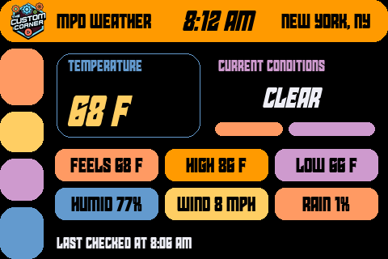

# MPD 1.0 — Multi-Purpose Display

MPD is a beginner-friendly information display project from [**The Custom Corner**](https://www.youtube.com/@TheCustomCorner101), built for the exact **Waveshare ESP32-S3-Touch-LCD-3.5** board.

The repository will eventually contain several independent display applications, such as weather, stock information, and YouTube statistics. Only the tested weather application is included right now.

## Available applications

### Weather

The current application retrieves weather from [Open-Meteo](https://open-meteo.com/) and displays:

- Current temperature and conditions
- Feels-like temperature
- Daily high and low
- Humidity
- Wind speed
- Precipitation probability
- Last-checked time
- A live clock for the configured location

Open-Meteo does not require an API key. The current interface uses an LCARS-inspired theme and defaults to New York, NY.



Application folder:

```text
applications/weather/MPD_Weather/
```

## Exact supported hardware

This project currently targets only:

- **Waveshare ESP32-S3-Touch-LCD-3.5**
- Waveshare SKU **30733**
- The original/non-B model—not the `3.5B`
- ESP32-S3R8 with 8 MB PSRAM and 16 MB flash
- 3.5-inch 320×480 ST7796 SPI display

[Buy the exact Waveshare ESP32-S3-Touch-LCD-3.5 board on Amazon](https://amzn.to/4fVmvU4) *(affiliate link)*

> **Affiliate disclosure:** As an Amazon Associate I earn from qualifying purchases. If you purchase through this link, The Custom Corner may receive a commission at no additional cost to you.

The LCD reset signal is controlled through the onboard TCA9554 I/O expander. Sketches intended for similar-looking ESP32-S3 displays will not necessarily work on this board.

## Tested software versions

Use these versions for a reproducible setup:

| Component | Tested version |
|---|---:|
| Arduino IDE | 2.3.10 |
| `esp32` by Espressif Systems | 3.3.11 |
| GFX Library for Arduino | 1.6.7 |
| TCA9554 by Rob Tillaart | 0.1.2 |
| ArduinoJson | 7.4.3 |

Do not use the Arduino_GFX 1.5.5 copy bundled in Waveshare's original package with ESP32 core 3.3.11. That combination fails to compile because it uses an older `spiFrequencyToClockDiv()` API. Arduino_GFX 1.6.7 contains the required compatibility fix.

## Install and configure

1. Download this repository with **Code → Download ZIP**, then extract it.
2. Open [MPD_Weather.ino](applications/weather/MPD_Weather/MPD_Weather.ino) in Arduino IDE.
3. Install the exact library versions listed above using Arduino IDE's Library Manager.
4. In the `MPD_Weather` folder, make a copy of `secrets.example.h` and name it `secrets.h`.
5. Put your Wi-Fi name and password in the new file:

```cpp
#pragma once

#define WIFI_SSID "YOUR_WIFI_NAME"
#define WIFI_PASSWORD "YOUR_WIFI_PASSWORD"
```

Close and reopen the sketch if Arduino IDE does not immediately show the new `secrets.h` tab. The real secrets file is ignored by Git and must never be committed.

## Change the weather location

Open [`LocationConfig.h`](applications/weather/MPD_Weather/LocationConfig.h). It contains the only three location values that normally need to be changed:

```cpp
constexpr char WEATHER_LOCATION[] = "NEW YORK, NY";
constexpr float WEATHER_LATITUDE = 40.7128f;
constexpr float WEATHER_LONGITUDE = -74.0060f;
```

1. Find the desired city with the [Open-Meteo Geocoding API](https://open-meteo.com/en/docs/geocoding-api).
2. Copy its `latitude` and `longitude` into `WEATHER_LATITUDE` and `WEATHER_LONGITUDE`.
3. Change `WEATHER_LOCATION` to the uppercase label that should appear in the title bar.
4. Keep the label fairly short. Abbreviate long place names so they fit beside the title and clock.
5. Verify and upload the sketch again.

The weather request is generated automatically from these coordinates. It uses Open-Meteo's `timezone=auto` option, and the returned UTC offset sets the display clock for the selected location. No separate timezone setting is required.

## Arduino board configuration

Select **ESP32S3 Dev Module**, then use:

| Tools option | Value |
|---|---|
| USB CDC On Boot | Enabled |
| CPU Frequency | 240MHz (WiFi) |
| Core Debug Level | None |
| USB DFU On Boot | Disabled |
| Erase All Flash Before Sketch Upload | Disabled |
| Events Run On | Core 1 |
| Flash Mode | QIO 80MHz |
| Flash Size | 16MB (128Mb) |
| JTAG Adapter | Disabled |
| Arduino Runs On | Core 1 |
| USB Firmware MSC On Boot | Disabled |
| Partition Scheme | 16M Flash (3MB APP/9.9MB FATFS) |
| PSRAM | OPI PSRAM |
| Upload Mode | UART0 / Hardware CDC |
| Upload Speed | 921600 |
| USB Mode | Hardware CDC and JTAG |
| Zigbee Mode | Disabled |

Select the board's COM port even if Arduino IDE describes it as `ESP32 Family Device, Ozobot DRVKit`. That text is a VID/PID auto-identification quirk; the board selection must remain **ESP32S3 Dev Module**.

## Upload

Compile the sketch first. After it verifies cleanly, connect the board, select its COM port, and click **Upload**.

> [!WARNING]
> Uploading this application overwrites the Waveshare factory demonstration firmware.

The Serial Monitor baud rate is **115200**. On startup, it reports Wi-Fi, clock synchronization, HTTP, JSON parsing, and display status.

The application deliberately keeps the display SPI clock at **40 MHz** for this initial stable baseline. Higher SPI speeds have not yet been enabled.

## Capture a screenshot

The weather firmware can send one exact 480x320 screenshot to a Windows PC over USB serial. It temporarily redraws the latest weather screen into PSRAM, transfers the RGB565 pixels, frees the temporary framebuffer, and returns to normal display operation.

Close Arduino Serial Monitor, then use the Python utility in [`tools/screenshot-capture`](tools/screenshot-capture/README.md):

```powershell
py -m venv .venv
.\.venv\Scripts\python -m pip install -r tools\screenshot-capture\requirements.txt
.\.venv\Scripts\python tools\screenshot-capture\capture_screenshot.py --port COM5 --output mpd-weather.png
```

Change `COM5` if the board has a different port. The tool requests only one frame, validates its CRC32 checksum, writes the PNG, and exits. The live weather screen must already be loaded before capture.

## Repository layout

```text
applications/
└── weather/
    └── MPD_Weather/
        ├── MPD_Weather.ino
        ├── LocationConfig.h
        ├── MPDAAFonts.h
        ├── TCCLogo46px.h
        └── secrets.example.h
docs/
└── images/
    └── mpd-weather.png
licenses/
└── StarGuard-font-notice.txt
tools/
├── font-converter/
│   ├── convert_font.py
│   ├── README.md
│   └── requirements.txt
└── screenshot-capture/
    ├── capture_screenshot.py
    ├── README.md
    └── requirements.txt
```

Future applications will receive their own folders under `applications/`. Display themes and shared code will be separated when a second application or theme makes that abstraction useful; the first public version intentionally keeps the working weather sketch easy to open and understand.

## Change the interface fonts

The checked-in `MPDAAFonts.h` was generated from desktop font files rather than written by hand. A reusable converter and complete Windows instructions are available in [`tools/font-converter`](tools/font-converter/README.md).

The converter accepts TTF or OTF files, creates the four required anti-aliased font sizes, and replaces the weather application's generated font header. Font widths differ, so compile and inspect the physical display after every font change.

## Current scope

- Weather is the only application currently included.
- The default location is New York, NY; it can be changed in `LocationConfig.h`.
- Touch input is not used by the weather application yet.

## Licenses

The source code is released under the [MIT License](LICENSE).

MIT remains a good fit for the project code because it allows viewers to use, copy, modify, and redistribute the software. It cannot relicense third-party assets, so those retain their original or separate terms.

The generated Star Guard font data and The Custom Corner logo have separate terms and are not covered by the MIT license. See [ASSET_LICENSES.md](ASSET_LICENSES.md) and the original [Star Guard font notice](licenses/StarGuard-font-notice.txt) before redistributing or using those assets commercially.
